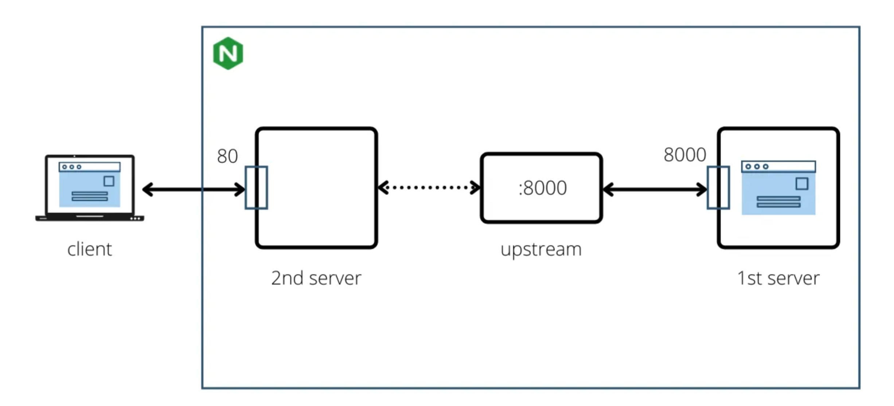
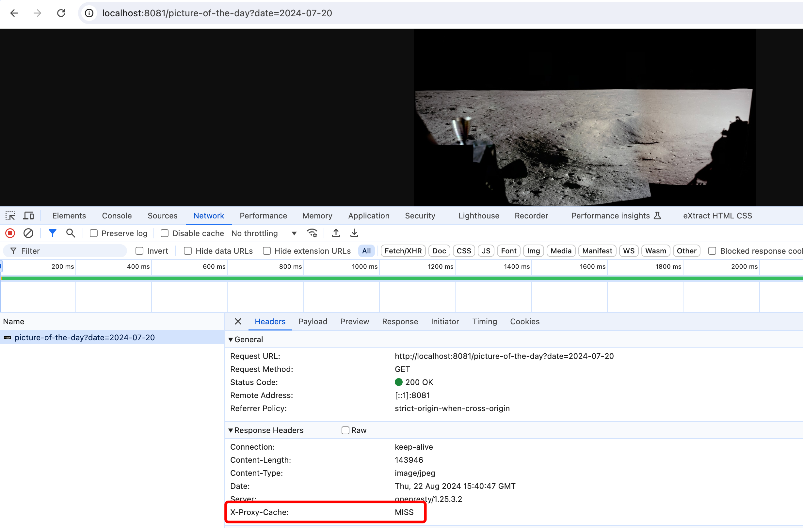
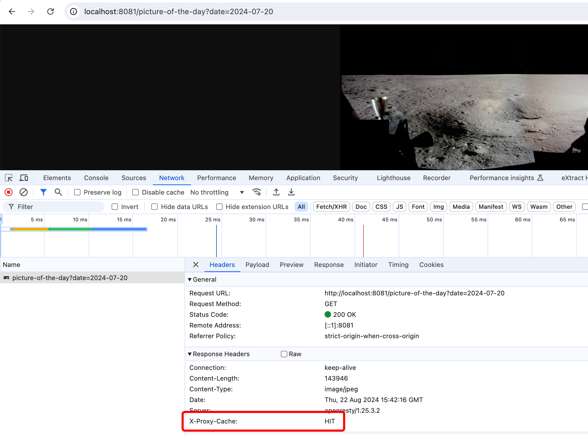
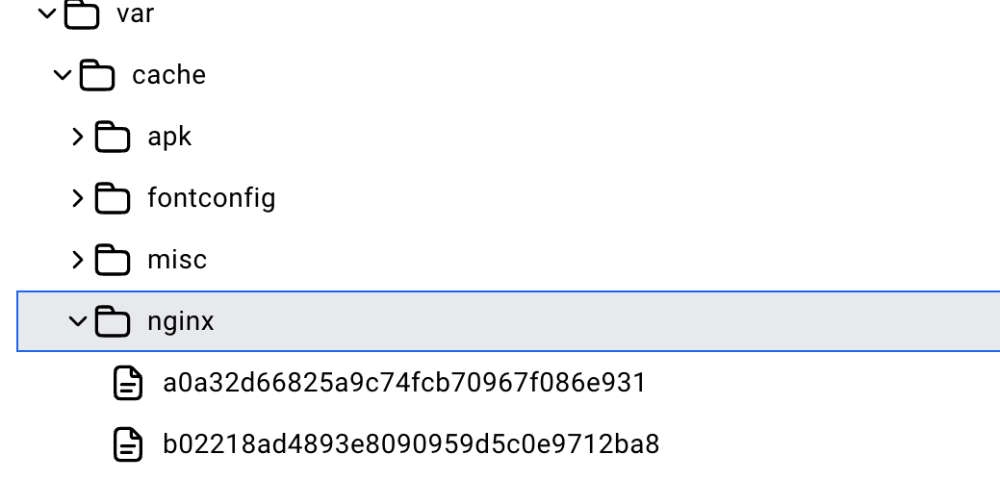
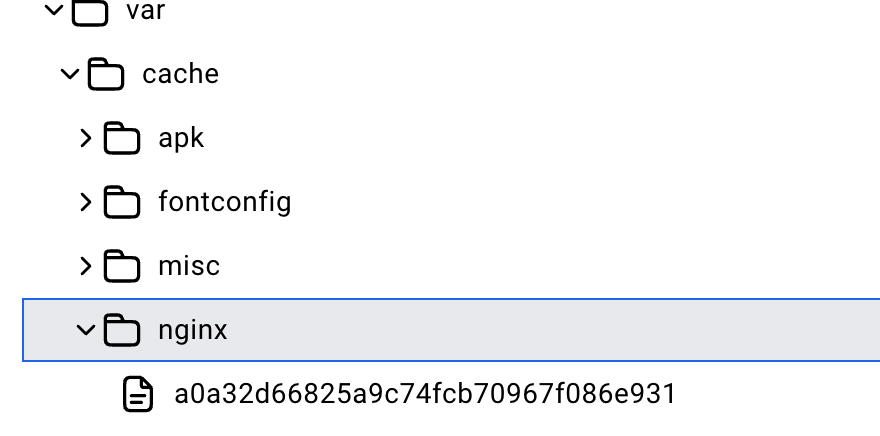

# Nginx images cache

## Architecture

Nginx will listen on port 8081 and serve as a cache for images retrieved from the Spring Boot Application.
The Spring Boot Application is a service that calls public Nasa API to get images by date.

Pictures identifiers are the dates passed as query paramenters in the url (http://localhost:8081/picture-of-the-day?date=2024-07-20). 
So the cache keys for the cache entities (pictures) are the hash of the date related to the picture.

## Demo
1. Run the command `docker-compose up` so the spring-boot-app and nginx containers start
2. Open http://localhost:8081/picture-of-the-day?date=2024-07-20 in your browser (any other date can be passed as query param)
3. The first and second time you make the request, we can observe cache status MISS that means that the picture is not cached

4. The third time you make the same request, we can observe cache status HIT that means that the picture is in the cache

5. In the nginx docker container we can see the caches items

6. We can remove a cached item by key (the date query param) by making a GET http://localhost:8081/picture-of-the-day?date=2024-07-20 request
7. We can see that the item is no more in the cache
